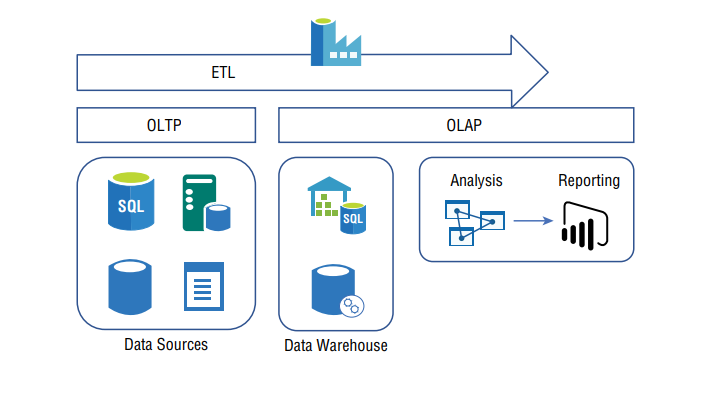

# DATA STORAGE

## Preview

Author said about core concept that require significant experience and knowledge if plan on taking the Azure Solution Expert exam. They are:

1. Security
2. Networking
3. Compute

Without compute, there is no place to run your application.
Without networking, there is no means to get access to the compute running the application.  
Without security, both your network and comoute are vulnerable to bad actors who may implements some kind of malicious act on you, your customer, or your employees.
***
The author choose to discussing about data before the application because **data has more weight** on the AZ Solution Architect Expert Exam than coding or designing an application does.
Even so, both these aspect (data and application) are fundamental and highly dependent on each other and you cannot have one without the other.

    "It is a captial mistake to theorize before one has data.
    Insensibly one begins to twist facts to suit theories, instead of theories to suit fact."

In this chapter you will :

- learn about AZ Data stores (Databases), other AZ Storage capabilities
- How to protect your data from loss
- How to keep it form being improperly accessed

With all of those options, again you are confronted with some decisions. Do you need AZ SQL, AZ Cosmo DB, Table Storage, AZ Files, Queue Storage.

What kind of redundancies do you need: LRS,ZRS, GRS? What kind migration options are avaiable?
What kind of Azure exist in the context of data
After reading this chapter, those and many additional question will be answered.

Let's first begin a summary of two basic data architectures that the AZ platform is structured for: traditional RDBMS and Big Data

## RDBMS, OLTP, OLAP, and ETL

The first database I ever used was written by yours truly.

Not same with what we call "Database" nowaday. What the author did is instantiate a **group of strings** with **hard-coded** set of data.
Author suppose in sense that would be like and in memory data structure that my code later analyzed and manipulated. That is pretty cool when you think about it 40 years ago.

**1. Flat files**: Exist in the early ages of data manipulation, like text files.
Problem start happening as it became hard to know how the content data was organized or categorized, and whether were any _**logical links**_ between data in a flat file.

That led the industy toward the creation of the _relational database management system (RDBMS)_ concept.

FIGURE 5.1 A traditional RDBMS scenario

**2. OLTP**:
Starting with _online transaction processing (OLTP)_ you see the place where the data is stored most commonly from an interaction with some kind of external system. For example, placing an online order or withdrawing cash from an ATM **would both reuslt** in insertion, retrieval, and/or update occurring on a transactional relation database.

**3. OLAP**:
_Online analytical processing_ components that are focused on storing a rather large amount of data from multiple sources into a single location, such as a data warehouse.
    The data warehouse is accessed and processed using, for example, AZ
Analysis Service that creates data models that are useful for rendering human-readable reports using, For example, Power BI.
Finally, the process by which the data flows between OLTP and OLAP is referred to as **4. extract, transform, load, (ETL)** which can be implemented in azure by using an **Azure Data Factory ADF**.

"FIGURE 5.1 " describe a rather complex RDBMS data architecture solution. This is will be your focus if your target is Azure and your workload requires this solution type.
For principle, those are components, and they can be designed and deployed following numerous other patterns.

***
    Comment of reader:
    You can see OLTP from any system around you, the characteristic of this type system is, any action for a record will be CURD database. Each action interact with DB is just impact single record or several record. (Independence), easy to manage and organize.

    OLAP is big sytem Who manage alot of OLTP, main responsible of it is place all OLTP in one location, analysis it. OLAP will interact will all record at 1 CRUD query.

    ETL/ELT is just a process which has take input is OLTP and fill them into OLAP.
    E: extract (extract from OLTP)
    T: transform (convert data - transform data to match with target DB - OLAP)
    L: load (load transformed data to OLAP)

    E: extract (extract from OLTP)
    L: load (load transformed data to OLAP - create new table (temp table) in OLAP)
    T: transform (convert data from temp table to target tabl, using schema or etc )
***

## NO SQL/ BIG DATA

    1. RDBMS will work and continues to work for the scenario for which was designed.
    2. But new concept (Big data / Machine Learning) have placed a strain on tradtional RDBMS solutions. (For ex: if data structure need to change, RDBMS have relation will make slows speed of change).
    3. The type of Data stored in Big data is large,
    4. People usually bring RDBMS skill into Big Data, that is not good. If data has no structure, how to use?
    5. Azure Analysis Services (mentioned earlier and visualized in Figure 5.1) helps make sense of such data.
    6. NoSQL is keyword often heared in the context of Big Data, It scale very well when the amount of data is large to gigantic in size.
    7. Companies such as Facebook, LinkedIn, and Google all use NoSQL database structures to store and access their data. Those companies earn money by analyzing and learning from the data collected from their services. Because the storage, analysis, and easy access to the data are fundamental to their business operations, they inherently favor the most effective and efficient data storage technologies.

## CHOOSING THE RIGHT DATA STORAGE SOLUTION

    1. Correct data store for the application may have already been decided if you are moving a workload to Azure.
    2. However, if you have the opportunity to deploy a greenfield project to Azure, then you must know the requirements of the application in order to choose the proper storage solution.

■ Document databases
■ Graph databases
■ Key/value pairs
■ Object storage
■ RDBMS
■ Search engine databases
■ Data analytics/data warehouse
■ Shared files

The following sections cover the intents and purposes of those database models.
The Azure Data Store or Azure Storage product that is designed for each specific model are provided as well.

1. Document Databases
   - A document database is one that stores data typically in one or more of the following formats: XML, JSON, or YAML.
   - The row in a document database consists of two columns: a **key** and a **document**.
   - Same with key-value, It mean key is unique and you can get document directly.
   - A **powerful feature** of the document database is that you **can query the contents of the document itself**.
   - The content stored in the document column are relatively small and typically in the form of collections, lists, or scalar items.
=> Which can meet the req about document database is **Azure Cosmos DB**

2. Key/Value Pairs
    - Similar to a document database, both document databases and key/value stores consist of two columns per row
    - However, there are some significant differences
        - The first one is the expected size of the data that will be stored: key/value expects that size gigantic, document database expect small.
        - A key/value store does not support aggregation which means the data cannot be found by querying. You can only retrieve data from the store using the keys’ value.
        - The value can be stored as an array of strings separated by a comma.
        - A common use case scenario for key/value pairs is for data caching.
    => Azure Cache for Redis, Azure Cosmos DB, Azure Table Storage.
    => The reason for choosing a key/value store versus a document database is based on expected size, the ability to query on the value, and speed.`

3. Graph Databases
    - Node and edges are two terms to know in regard to a graph database store.
    - A node can be viewed as an entity, in the same way an entity is the value that is stored in a document database. The information contained within that node is comprised of all the data that defines it.
    - An edge is what defines the relationships between the nodes.
    - An edge is what defines the relationships between the nodes.
    - Relationships between nodes are complicated, dynamic, and change rapidly -> this kind of data store may provide your best solution.
    - Scaling in real time.
    => VMs
    - Real-time reporting, you may need a graph database store.
    => Azure Cosmos DB is the product that provides graph database capabilities via Gremlin APIs for the creation of entities and the execution of query operations against them.
    => VMs can be seen as nodes, but nodes in the graph database context are logical, not physical.

4. Object Storage
   - Binary Large Object (BLOB) storage, aka object storage, is an entity comprised of a collection of binary data that is stored into a database system.  
   - Azure Batch, Azure Apps, and Azure Functions, all of which use an Azure Blob Storage container for providing their services.
    => Azure Storage:  Azure Blob Storage is the product that will fulfill your Object Storage needs.

5. Relational Database Management System
    - Azure provides numerous RDBMS products such as Azure SQL Database, Azure Database for MariaDB, Azure Database for PostgreSQL, and Azure Database for MySQL.
    - Each provides capabilities commonly found in RDBMs, such as SQL query capabilities, joins, stored procedures, and triggers.
    - A column or a group of columns on a row are used to uniquely identify the data row and is known as a primary key. This key can be used when creating relationships between two or more tables.
    => Concept about ACID: atomic, consistent, isolated, durable (ACID).

    - When data is stored on an RDBMS, it occurs in the form of a transaction. a transaction is guaranteed if it consists of the ACID properties.

    - ACID is an acronym that begins with atomic, which means that the transaction executes as a single unit and either completely succeeds or completely fails.
    - atomic: which means that the transaction executes as a single unit and either completely succeeds or completely fails.
    - Consistency: guarantees that the data does not become corrupted. For example having a row with a foreign key without a match on the parent table.
    - Isolation: Keep the diff transaction in diff environment, and only apply change after it complete. If transactions execute at the same time then need a strategy to make it not impact another.
    - Durability ensures a transaction gets committed even if there is an exception or perhaps a power outage.

    - RDBMS database scenarios are most useful for reporting, accounting, inventory, and order management. Any scenario where you would want to have clearly defined data and their relationship with data on other tables fit into this data storage scenario.

6. Search Engine Databases  
    - this data store is optimized for scenarios as one would expect to be found for powering search engines, as the name implies.
    - when you need to store and index large amounts of data as well as provide a quick response from the query match.
    - Cannot do with all storage systems. When all your database will do is respond with data based on a string of text, this is the correct place to focus.  
    => Think about that approach on a traditional RDBMS
    with columns and rows. How would you formulate a SQL query for such a transaction?
    There would need to be a column to search for the string of text, and that column would be
    wide. RDBMS simply doesn’t align well with such a requirement.

    => Azure cognitive service can take some words and interpret their intent. Not only can you get a result based on some text, but you can also attempt to understand what the words mean and then tweak the query even more

    => There are scenarios in which you place a search database and search engine logic
    in front of a more traditional structure. You would need to create and populate the search
    database with searchable fields that link to the means of capturing the true, intended result set from a backend, traditionally structured, or non–search engine optimized (SEO) database
    => Azure Search + Azure cognitive service

7. Data Analytics/Data Warehouse.

    - Is a central data store that receives data from many different sources that is then used for reporting and data analysis.
    - **Data warehousing** and **data analysis** are both components of **data analytics**. Data warehousing is a term for where the data is stored.
    And data analysis is the process you use to assist decision making.
    - The data that exists in a data warehouse can be historical or near real-time, but in most cases the data comes from multiple sources and will be in multiple formats.
    - Requires some modifications to the data so that it can be later analyzed in combination with data from other sources.
    - Two data warehouse schemas (star and snowflake) that are designed in Azure to work well.

    => Azure provides all of the components necessary to create, deploy, and execute your **data analytics** with products such as Azure Synapse Analytics (formerly Azure SQL Data Warehouse), Azure Data Factory (ADF), Azure Data Lake Store (ADLS), Azure Data Lake, and
    Azure Analysis Services.
    => **Keep in mind that for the exam you may need to know the purpose each of the products plays within a data analytics context.** The internals of how they work, how to build data warehouse structures, and how to query them are not part of the exam.

    1. Azure Synapse Analytics
    2. Azure Data Factory (ADF)
    3. Azure Data Lake Store (ADLS)
    4. Azure Data Bricks
    5. Azure Data Lake
    6. Azure Analysis Services
    7. Azure Data Explorer (ADX) and Azure Storage Explorer

***
aspect: [N] view point or edge side
full-blown: solve all problem.
high majority of case: =  In a most of case
further: more and more.
properly: [ADV] Correct way.
improperly: not correct way.
traditional: long time ago, "Tet holiday is traditional event."
These day : nowaday

In contrast: nguoc lai,

manipulated: do action
 intended: focus on, purpose on
***
